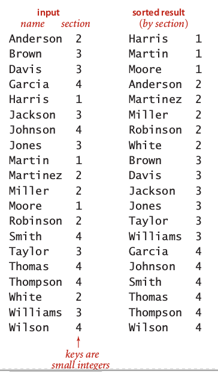
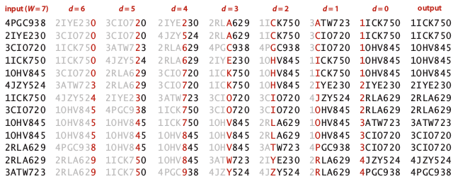
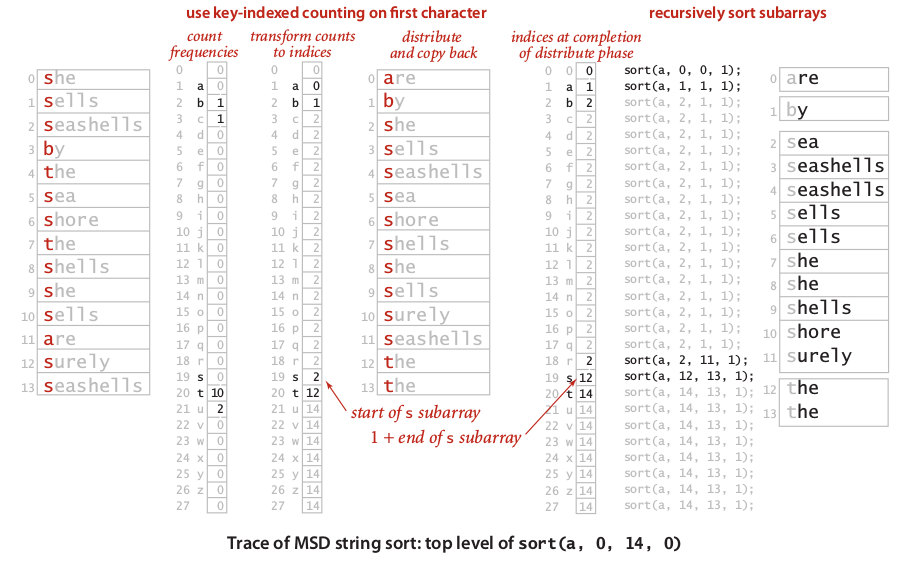
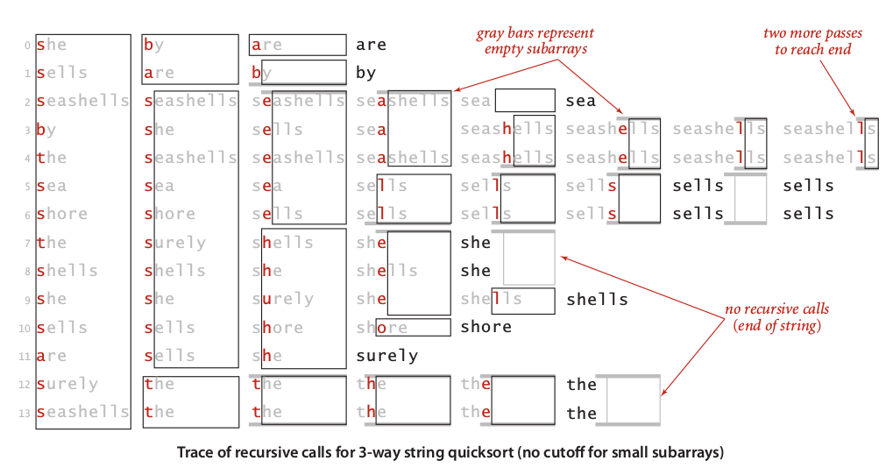

## 1\. String Sorts {#1-string-sorts}

This section discuss how we solve sorting problem in the case of string. Does not like any general sorting algorithms that we already knew, sorting the string has different method to achieve better performance. On the other hand, we should have insight about the string before execute any sorting algorithm. The useful insight that may important, such as, randomness, longest common prefixes, encoding used in the string, etc. Without enough insight about the string we dealing, our sorting algorithm may not performed well as expected.

### Key-Indexed Counting {#key-indexed-counting}



Before we discuss any string algorithms, we need to understand how to indexing set of string-integer pairs. An example of string-integer pairs illustrated in the left.

Intuitively, the idea of key-indexed is sort string by its key. That’s why we can utilized this method for complex string sort discussed later. Below, the implementation of key-indexed counting in java:

```
int N = a.length;

String[] aux = new String[N];
int[] count = new int[R+1];  // R is Radix

// Computer frequency counts
for (int i=0; i < N; i++)
	// key() return section
	count[a[i].key() + 1]++;
// Transform counts to indicies
for (int r = 0; r < R; r++)
	count[r+1] += count[r];
// Distribute the records
for (int i = 0; i < N; i++)
	aux[count[a[i].key()]++] = a[i];
// Copy back
for (int i = 0; i < N; i++)
	a[i] = aux[i];
```

At first step, we used key+1 index in frequency counts to get the offset of each occurrences, not just count how many key we found. In the example above, the result of count array will be [0, 0, 3, 5, 6, 6]. The first and second index will always be zero.

At second step, we transform our array count into array of indexes, so our count array will be[0, 0, 3, 8, 14, 20]. What we can tell from that array is we can found strings with key of two start at index two, we can found strings with key of three start at index seven, and goes on for the rest on array. Some may think that this method similar with offset method in pagination. Pay attention that our first and second indexes still has zero value.

At third step, we distributed each string based on its key that we have indexed in the count array. By incrementing each index stored in count array, our count array will be [0, 3, 8, 14, 20, 20] after each string sorted in the auxiliary array.

Last step is copying all sorted string in the auxiliary array back into original array of string.

The running time of key-indexed counting is **8N+3R+1**which is proofed by N+R+1 for initializations, 2N for first step, 2R for second step, 3N for third step, and 2N for fourth step.

### Least-Significant-Digit (LSD) Radix Sort {#least-significant-digit-lsd-radix-sort}

The term least significant means we examines every character in the string from **right-to-left**, while term digit means we used standard string encoding, such as base-256 ASCII string. Since doing scan from right-to-left, LSD is useful for sorting **fixed-length strings**, such as car license plates, IP addresses, back account numbers, telephone number, etc.

LSD is quite simple because we can adapt the key-indexed counting method as we mentioned before. Here the implementation of LSD in java:

```
int N = a.length
int R = 256;
String[] aux = new String[N];

for (int d = W-1; d>= 0; d--)
{ // W is fixed length of all strings
	int[] count = new int[R+1];
	for (int i = 0; i < N; i++)
		count[a[i].charAt(d) + 1]++;
	for (int r = 0; r < R; r++)
		count[r+1] += count[r];
	for (int i = 0; i < N; i++)
		aux[count[a[i].charAt(d)]++] = a[i];
	for (int i = 0; i < N; i++)
		a[i] = aux[i];
}
```

The trace of LSD algorithm illustrated in the image below:

Image 1: Trace of LSD

The running time of LSD is **~7WN+3WR**and extra space proportional to **N+R**.

### Most-Significant-Digit (MSD) Radix Sorting {#most-significant-digit-msd-radix-sorting}

Surely, most of practical cases in string processing dealing with non-fixed length string. So, to achieve general purpose string sort algorithm we need to implement a method that capable to scan character of string from left-to-right. In this case, we implement MSD.

The key idea of MSD similar with quicksort, but instead used two or three partition, MSD only used a subarray as partition to sort. Then for every string in the set, MSD recursively partitioning and sort subarray. Surely, the length of partition always reduced over time since we dealing with non-fixed length string.

Below the implementation of MSD in java:

```
public class MSD {
	private static int R = 256;  // radix
	private static final int M = 5;  // cuttof that indicate small array
	private static String[] aux;  // Auxiliary array for distribution

	private static int charAt(String s, int d) {
		// Return character encoding index, or -1 if outsite length of string
		if (d < s.length()) return s.chartAt(d); else return -1;
	}

	public static void sort(String[] a) {
		int N = a.length;
		aux = new String[N];
		sort(a, 0, N-1, 0);
	}

	private static void sort(String[] a, int lo, int hi, int d) {
		if (hi <= lo + M) {
			Insertion.sort(a, lo, hi, d); return;
		}
		int[] count = new int[R+2];
		for (int i = lo; i <= hi; i++)
			count[charAt(a[i], d) + 1]++;
		for (int r = 0; r < R+1; r++)
			count[r+1] += count[r];
		for (int i = lo; i <= hi; i++)
			aux[count[charAt(a[i], d) + 1]++] = a[i];
		for (int i = lo; i <= hi; i++)
			a[i] = aux[i-lo];
		for (int r = 0; r < R; r++)
			sort(a, lo + count[r], lo + count[r+1] – 1, d+1);
	}
}
```

Image below illustrate MSD on small set of string which has R=15 (LOWERCASE encoding):

Image 2: Trace of MSD

We maintenance cutoff value to identify small array, so we can improve running time of sorting in MSD by implementing insertion sort for small array. Another aspect that we should concern about is radix range in MSD. It is okay for standard ASCII which has R=256, but for UNICODE which has R=65536, it is not good.

The running time of MSD is between **8N+3R**and **~7wN+3WR**, where w is the average string length.

### Three-Way String Radix Quicksort {#three-way-string-radix-quicksort}

As mentioned before, MSD could be slow for the case of huge encoding sizes, such as UNICODE which is has 65536 mapped encodes. To solve that problem, we need to remove need of auxiliary array. Three-way string quicksort will do that, by maintenance three-way partitioning code: first partition less than second partition and third partition larger than second partition. We can say that this algorithm is a hybrid that combine normal quicksort and MSD.

Below the implementation of three-way string quicksort in java:

public class Quick3string {private static int charAt(String s, int d) {// Return character encoding index, or -1 if outsite length of stringif (d &lt; s.length()) return s.chartAt(d); else return -1;}public static void sort(String[] a) {sort(a, 0, a.length -1, 0);}private static void sort(String[] a, int lo, int hi, int d) {if (hi

**Illegal HTML tag removed :**

int lt = lo, gt = hi;

int v = charAt(a[lo], d);

int i = lo + 1;

while (i &lt;= gt)=&quot;&quot; {<br="">
int t = charAt(a[i], d);

if (t &lt; v) exch(a, lt++, i++);

else if(t &lt; v) exch(a, i, gt--);

else i++;

}

sort(a, lo, lt-1, d);

if (v &gt;= 0) sort(a, lt, gt, d+1);

sort(a, gt+1, hi, d);

}

}</br="">

Image below illustrate trace of three-way quicksort in small set of strings without cutoff:

Image 3: Trace of 3-way string quicksort

Since in the core three-way quicksort implemented normal quicksort extensively, the running time of three-way quicksort s about **~2NlnN**on the average.