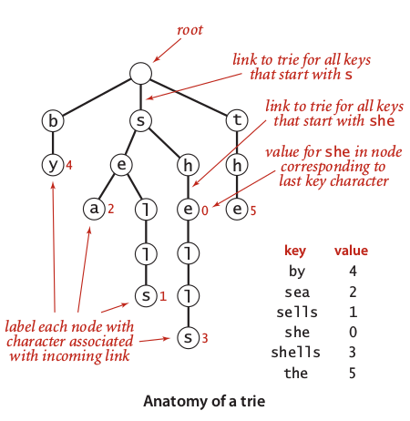

## 2\. Tries {#2-tries}

In this section, we dealing with **string search problem**. A primitive algorithm such as BST or Red-Black BST has been discovered as base performance in the case of searching set of integers or characters. In string cases, we look for improvement opportunity by looking at the pattern such as some of string may share common longest prefix or has uniformly distributed length. The tries is pattern aware, thus offered suitable data structure that optimizing string search running time. It is like compression method, but in this case we highly used graph theory.

Too avoid confusion with term ‘tree’, a term trie came from word re**_trie_**val which is introduced by E.Fredkin in 1960\. It is little bit like a wordplay same as term ‘dynamic programming’ that refer to mathematical concept, not exactly about computer programming.

Image 4 illustrated the anatomy of a trie correspond to small set of words. To reproduce a trie construction illustrated in image 4, we need to following rules:

1.  Image 4: Anatomy of a trie

    A root is a node with null values.
2.  All leafs are nodes that do not have child or followed by null link.

3.  A trie correspond to map of key-value pair, in this case, key is string and value is integer of string identifier.

4.  A string may a prefix or suffix of another string, while a complete string is a path from root to any leaf. For example, a word ‘she’ is a prefix of word ‘shells’ that each terminated by id 0 and 3.

### R-Way Trie {#r-way-trie}

The idea of R-way trie is we take R possible value to create each parent node, so we can satisfy randomness of input string cases. For example, if we need to indexing any ASCII based words and all the words are distributed uniformly, then at least we need to satisfy _L__R_possible combinations, where L is average length of string. Image 5 illustrated the construction of R-Way trie for 256 ASCII characters of word sea, shells, and she.

Image 5: R-Way tries construction

Below, the implementation of R-way tries in Java:

public class TrieST**Illegal HTML tag removed :**

{

private static int R = 256;

private Node root;

private static class Node

{

private Object val;

private Node[] next = new Node[R];

}

public Value get(String key)

{

Node x = get(root, key, 0);

if (x == null) return null;

return (Value) x.val;

}

private Node get(Node x, String key, int d)

{

if (x == Null) return null;

if (d == key.length()) return x;

char c = key.chartAt(d);

return get(x.next[c], key, d+1);

}

public void put(String key, Value val)

{

root = put(root, key, val, 0);

}

private Node put(Node x, String key, Value val, int d)

{

if (x == null) x == new Node();

if (d == key.length()) { x.val = val; return x; }

char c = key.chartAt(d);

x.next[c] = put(x.next[s], key, val, d+1);

return x;

}

}

Since each level of trie consisted by nodes taken from set of array with R-length, then each level has probability 1/R to be passed by search operations. Thus, the running time of R-way tries is **~log****R****N** and space in between **RN** and **RNw**, where R is radix, N is max length of string, and w is average length of string. In the case of speed, this is good, but not for space. In typical system, R-way tries will be not possible to be implemented for millions string of unicode.

### Ternary Search Tries (TST) {#ternary-search-tries-tst}

Image 6: TST constuction

As mentioned before, the implementation of R-way tries required huge of space. In the practical point of view, the R-way tries is not suitable. To be helped with practical cases of bug data, we need to understand that the **typical input is not random**. In the case of non-randomness string, we knew that there will be occurred such any patterns and repetition. Thus, by knowing this fact, it is possible to reduce R-way tries into K-way tries which is value of K should be very small as possible.

Based on its name, Ternary Search Tries (TST) is reduced version of R-way tries that has three links at most. Looking the construction of TST which illustrated in image 6, we realize that TST required different representation. Since we reduced the possibility of word occurrences, **each character appear****explecitly** in nodes, so we only need to examines exactly 1/3 probability despite the length of its encoding. The search operation illustrated in image 7.

Image 7: Search on TST

Below the implementation of TST in java:

public class TST

**Illegal HTML tag removed :**

{

private Node root;

private class Node

{

char c;

Node left, mid, right;

Value val;

}

public Value get(String key);

private Node get(Node x, String key, int d)

{

if (x == null) return null;

chat c – key.chartAt(d);

if (c &lt; x.c) return get(x.left, key, d);

else if (c &gt; x.c) return get(x.right, key, d);

else if (d &lt; key.length() - 1) return get(x.mid, key, d+1)

else return x;

}

public void put(String key, Value val){root = put(root, key, val, 0);}private Node put(Node x, String key, Value val, int d){char c = key.charAt(d);if (x == null) { x = new Node(); x.c = c; }if (c &lt; x.c) x.left = put(x.left, key, val, d);else if (c &gt; x.c) x.right = put(x.roght, key, val, d);else if (d &lt; key.length() - 1) x.mid = put(x.mid, key, val, d+1);else x.val = val;return x;}}

Since there is 1/3 possibility of occurrence of each character in string, the running time of TST is approximately **~ln N**and space in between **3N** and **3Nw**.