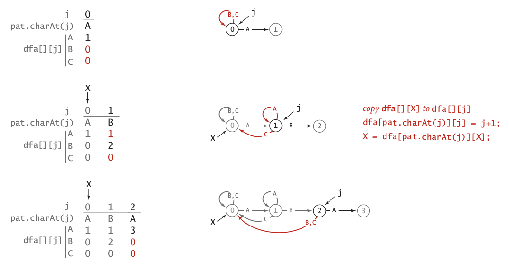
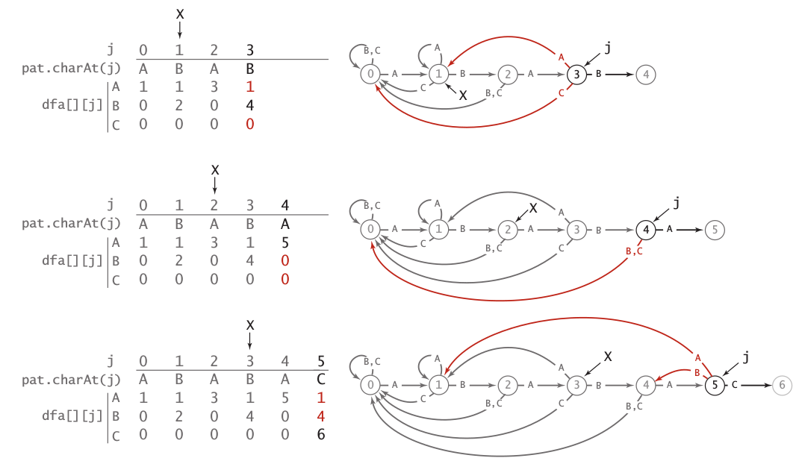
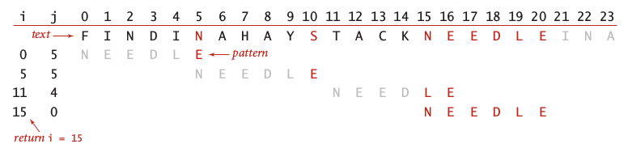
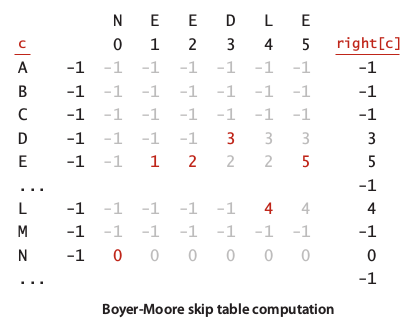
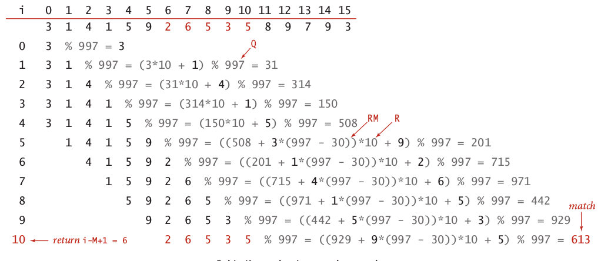

## 3. Substring Search {#3-substring-search}

Let’s make a leap, since brute force implementation is not consideration because its running time \(**~NM**\), our attention here is more efficient algorithms.

### Knuth-Morris-Pratt \(KMP\) Substring Search {#knuth-morris-pratt-kmp-substring-search}

The idea of KMP algorithm is by remove backup lookup in brute force algorithm, we can implement substring search in linear time, equal to **N** characters. For example, we need to find pattern _AB**A**BC_ in text _ABAB**A**BC_. When there is a mismatch in position 4, KMP will choose better restart position which is 2 to continue the search. To make it happen, KMP need to do preprocessing which has running time equal to **M**. One of proper preprocessing for KMP is **DFA** \(Deterministic Finite Automata\).

The graphical implementation of constructing DFA of pattern _ABABC_ illustrate in image 8 and 9.

Image 8: Constraction of DFA ABABC \(1\)

Image 9: Construction of DFA ABABC \(2\)

The implementation of KMP algorithm in java will be like this:

```
import edu.princeton.cs.algs4.In;
import edu.princeton.cs.algs4.StdIn;
import edu.princeton.cs.algs4.StdOut;

public class KMP
{
    private String pat;
    private int[][] dfa;

    public KMP(String pat)
    {  // Construct DFA from pattern
        this.pat = pat;
        int M = pat.length();
        int R = 256;
        dfa = new int[R][M];
        dfa[pat.charAt(0)][0] = 1;
        for (int X = 0, j = 1; j < M; j++) {
            // Compute dfa[][]
            for (int c = 0; c < R; c++)
                dfa[c][j] = dfa[c][X];
            dfa[pat.charAt(j)][j] = j+1;
            X = dfa[pat.charAt(j)][X];
        }
    }

    public int search(String txt)
    {  // Simulate operation of DFA on txt
        int i, j, N = txt.length(), M = pat.length();
        for (i = 0, j = 0; i<N && j<M; i++)
            j = dfa[txt.charAt(i)][j];
        if (j == M)    return i-M;      // Found
        else        return N;         // Not found
    }

    /**
     * Will print:
     * % java KMP AACAA AABRAACADABRAACAADABRA
     * text: AABRAACADABRAACAADABRA
     * pattern:          AACAA
     */
    public static void main(String[] args)
    {
        String pat = args[0];
        String txt = args[1];
        KMP kmp = new KMP(pat);
        StdOut.println("text:    " + txt);
        int offset = kmp.search(txt);
        StdOut.print("pattern: ");
        for (int i = 0; i < offset; i++)
            StdOut.print(" ");
        StdOut.println(pat);
    }
}
```

Worst case processing time of KMP is **N+M**, since M time for preprocessing and N time for searching.

### Boyer-Moore Substring Search {#boyer-moore-substring-search}

Boyer-Moore algorithm used heuristic method to find mismatched and scan each character in the direction **right-to-left**. Below the step by step of how Booyer-Moore algorithm doing mismatched character heuristic:

1. Let _i_  = 0 and _s_  = 0 for skip value.

2. Let _j_  = length of pattern.

3. Compare character of  pattern\[_j_\] with text\[_i+j_\].

4. If not matched, set _s_ to _j_-\(index of missmatched\). then increment _i_ by _s_. Back to step 2.

5. Else decrement _j_ by 1 and back to step 3.

An image below illustrate how Boyer-Moore algorithm find pattern _NEEDLE_ in the text _FINDINAHAYSTACKNEEDLE_.



Image 10: Example of missmatched character heuristic

Obviously, we can do this in linear time by constructing an array to lookup which index in the pattern. Lets called that array as  _right\[\]_ since we used this array for reverse lookup, right to left. Simply, we just need to allocate _R_ sized array, then filled each index by -1 for each index of character that not found in the pattern, and 0 to M for character found in the pattern by left order. The construction of _right\[\]_ array for pattern _NE**E**DLE_  illustrate in image 11.



Image 11: Right array example

The implementation of Boyer-Moore algorithm in java will be like this:

```
import edu.princeton.cs.algs4.In;
import edu.princeton.cs.algs4.StdIn;
import edu.princeton.cs.algs4.StdOut;

class BoyerMoore
{
    private int[] right;
    private String pat;

    BoyerMoore(String pat)
    {  // Computer skip table
        this.pat = pat;
        int M = pat.length();
        int R = 256;
        right = new int[R];
        for (int c=0; c<R; c++)
            right[c] = -1;
        for (int j=0; j<M; j++)
            right[pat.charAt(j)] = j;
    }

    public int search(String txt)
    {  // Search for pattern in txt
        int N = txt.length();
        int M = pat.length();
        int skip;
        for (int i=0; i<=N-M; i+=skip) {
            skip = 0;
            for (int j=M-1; j>=0; j--) {
                if (pat.charAt(j) != txt.charAt(i+j)) {
                    skip = j-right[txt.charAt(i+j)];
                    if (skip<1) skip = 1;
                    break;
                }
            }
            if (skip == 0) return i;  // Found
        }
        return N;                      // Not found
    }

    /**
     * Will print:
     * % java BoyerMoore AACAA AABRAACADABRAACAADABRA
     * text: AABRAACADABRAACAADABRA
     * pattern:          AACAA
     */
    public static void main(String[] args)
    {
        String pat = args[0];
        String txt = args[1];
        BoyerMoore boyerMoore = new BoyerMoore(pat);
        StdOut.println("text:    " + txt);
        int offset = boyerMoore.search(txt);
        StdOut.print("pattern: ");
        for (int i = 0; i < offset; i++)
            StdOut.print(" ");
        StdOut.println(pat);
    }
}
```

The typical implementation of Boyer-Moore algorithm like code above will guarantee worst case running time to **NM**. Furthermore, a full implementation of Boyer-Moore will provide linear-time worst-case guarantee by implementing KMP-like table. If we look into Image 10, its like we can choose better skip value by implementing KMP-like array rather than simply decrement index of _j_.

### Rabin-Karp Fingerprint Search {#rabin-karp-fingerprint-search}

Rabin-Karp algorithm use **hash function** to encode pattern and substring of text, so a match occurred if only if encoded value of pattern equal to substring. We implement **Horner method**  to do efficient modular hashing on substring of M length. A simple hash function of substring formulated by:

To avoid recalculation, we can derived formula above to compute next substring by subtracting one left most binomial value, increase the order of rest binomial and added a constant at last:

formula

To avoid exhaustive computation and reduce space \(since length of integer 231\), we only need to reproduce the remainder of each hash value. This method called as modular hashing.

formula

where _Q_ is any prime number. This calculation is similar to calculation in hash table, but in this case, we do not store each hash value in a table, we only care of the hash value for each substring. Since choose for right value of _Q_ is not trivial problem, we can guarantee that by choosing large enough value for _Q_, the probability of **collision** is 1/_Q_. This approach called as by **Monte Carlo correctness**. But, if in the case we use defensive approach, then we should ensure that matching always correct. In that case we used approach called as **Las Vegas correctness**. This approach required back-up for testing of correctness operation. Graphical implementation of Rabin-Karp algorithm illustrated in image below.



Image 12: Rabin-karp implementation

The implementation of Rabin-Karp algorithm in Java will be look like this:

```
import edu.princeton.cs.algs4.In;
import edu.princeton.cs.algs4.StdIn;
import edu.princeton.cs.algs4.StdOut;

public class RabinKarp
{
	private String pat;		// Only needed for Las Vegas
	private long patHash;
	private int M;
	private long Q;
	private int R = 256;
	private long RM;

	public RabinKarp(String pat)
	{
		this.pat = pat;
		this.M = pat.length();
		Q = longRandomPrime();
		RM = 1;
		for (int i = 1; i <= M; i++)
			RM = (R * RM) % Q;
		patHash = hash(pat, M);
	}

	// Monte carlo
	// public boolean check(int i)
	// {
	// 	return true;
	// }

	// Las Vegas
	public boolean check(String txt, int i)
	{
		for (int j = 0; j < M; j++)
			if (pat.charAt(j) != txt.charAt(i+j))
				return false;
		return true;
	}

	private long hash(String key, int M)
	{
		long h = 0;
		for (int j = 0; j < M; j++)
			h = (R * h + key.charAt(j)) % Q;
		return h;
	}

	private int search(String txt)
	{
		int N = txt.length();
		long txtHash = hash(txt, M);
		if (patHash == txtHash) return 0;
		for (int i = M; i < N; i++) {
			txtHash = (txtHash + Q - RM*txt.charAt(i-M) % Q) % Q;
			txtHash = (txtHash*R + txt.charAt(i)) % Q;

			int offset = i - M + 1;
			if (patHash == txtHash && check(txt, offset))
				return offset;  // Match
		}
		return N;  // No match found
	}
}
```

Rabin-Karp substring search is known as **fingerprint** search because it uses a small amount of information to represent a pattern. Then it looks for this fingerprint \(the hash value\) in the text. The algorithm is efficient because the fingerprints can be efficiently computed and compared.

